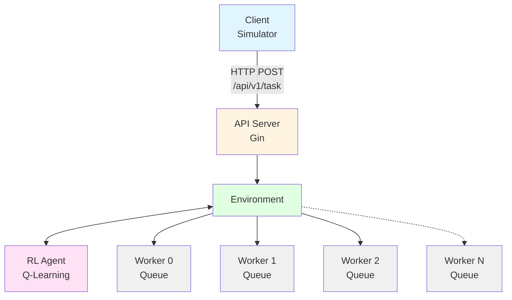

# Q-Router-Go

A reinforcement learning-based task routing system built in Go that dynamically assigns tasks to workers using Q-learning to optimize performance and throughput.

## Overview

Q-Router-Go implements an intelligent task routing system where an RL (Reinforcement Learning) agent learns to distribute tasks across multiple workers with different performance characteristics. The system uses Q-learning to adapt its routing strategy based on queue states and worker performance, maximizing throughput while minimizing task failures.

### Features

- **Reinforcement Learning**: Q-learning agent that adapts routing decisions based on environment state
- **Multiple Workers**: Configurable number of workers with customizable performance policies
- **REST API**: Full REST API with Swagger documentation for task submission and monitoring
- **WebSocket Support**: Real-time statistics streaming via WebSocket
- **Task Simulator**: Built-in load testing tool to generate task traffic
- **Performance Metrics**: Track throughput, task distribution, and worker utilization

## Architecture



## Installation

1. Clone the repository:
```bash
git clone https://github.com/yourusername/q-router-go.git
cd q-router-go
```

2. Install dependencies:
```bash
go mod download
```

3. (Optional) Generate Swagger documentation:
```bash
go install github.com/swaggo/swag/cmd/swag@latest
swag init -g cmd/api-server/main.go
```

## Project Structure

```
q-router-go/
├── cmd/
│   ├── api-server/      # REST API server with Swagger
│   ├── rl-test/         # Standalone RL testing program
│   └── simulator/       # Load testing simulator
├── internal/
│   ├── apihandler/      # HTTP handlers and WebSocket
│   ├── learner/         # Q-learning RL agent
│   └── worker/          # Worker environment and task processing
├── docs/                # Swagger documentation
└── static/              # Static files (if any)
```

## Usage

### 1. Start the API Server

The API server provides REST endpoints and WebSocket for real-time statistics:

```bash
go run cmd/api-server/main.go
```

The server will start on `http://localhost:8080` with the following endpoints:

- `GET /api/v1/ping` - Health check
- `POST /api/v1/task` - Submit a new task
- `GET /api/v1/statistics` - Get current worker statistics
- `GET /api/v1/ws` - WebSocket connection for real-time statistics
- `GET /swagger/*` - Swagger UI documentation

Access Swagger UI at: http://localhost:8080/swagger/index.html

### 2. Run the Task Simulator

Generate load to test the system:

```bash
# Default: Send tasks every 50ms indefinitely
go run cmd/simulator/main.go

# Send 100 tasks with 100ms interval
go run cmd/simulator/main.go --interval=100ms --count=100

# Custom task type and faster rate
go run cmd/simulator/main.go --type=heavy --interval=20ms

# Different API endpoint
go run cmd/simulator/main.go --url=http://localhost:9000/api/v1/task
```

#### Simulator Options

- `--url`: API endpoint URL (default: `http://localhost:8080/api/v1/task`)
- `--interval`: Time between tasks (default: `50ms`)
- `--type`: Task type/payload to send (default: `"default"`)
- `--count`: Number of tasks to send, 0 for infinite (default: `0`)

### 3. Run the RL Test Program

Standalone program to test RL agent behavior without the API:

```bash
go run cmd/rl-test/main.go
```

This runs a local simulation with configurable workers and tasks to evaluate the RL agent's learning performance.

## API Examples

### Submit a Task

```bash
curl -X POST http://localhost:8080/api/v1/task \
  -H "Content-Type: application/json" \
  -d '{"type": "processing-task"}'
```

Response:
```json
{
  "status": "completed"
}
```

### Get Statistics

```bash
curl http://localhost:8080/api/v1/statistics
```

Response:
```json
{
  "taskThroughput": 45.23,
  "totalProcessedTasks": 1523,
  "tasksPerWorker": [412, 389, 401, 321],
  "dismissedTasks": 12
}
```

### WebSocket for Real-Time Statistics

```javascript
const ws = new WebSocket('ws://localhost:8080/api/v1/ws');

ws.onmessage = (event) => {
  const stats = JSON.parse(event.data);
  console.log('Statistics:', stats);
};
```

## Configuration

### Worker Configuration

Workers are configured in [cmd/api-server/main.go](cmd/api-server/main.go):

```go
workerCount := 4
agent := learner.NewRLAgent(0.5, 0.5, 0.1, workerCount)

// Configure sleep policies for each worker
env.SleepPolicies[0] = worker.CreateSleepPolicy(500, 500, 0, 0.0)  // Slow worker
env.SleepPolicies[1] = worker.CreateSleepPolicy(40, 60, 0, 0.0)    // Fast worker
env.SleepPolicies[2] = worker.CreateSleepPolicy(0, 100, 0, 0.0)    // Variable worker
env.SleepPolicies[3] = worker.CreateSleepPolicy(50, 50, 800, 0.1)  // Occasional lock
```

### RL Agent Parameters

- **Alpha (α)**: Learning rate (0.0-1.0) - how much new information overrides old
- **Gamma (γ)**: Discount factor (0.0-1.0) - importance of future rewards
- **Epsilon (ε)**: Exploration rate (0.0-1.0) - probability of random action

## Testing

Run all tests:
```bash
go test ./...
```

Run tests with verbose output:
```bash
go test ./... -v
```

Run tests for specific package:
```bash
go test ./internal/learner -v
go test ./internal/worker -v
go test ./internal/apihandler -v
```

Run tests with coverage:
```bash
go test ./... -cover
```

## Building

Build all binaries:
```bash
# Build API server
go build -o bin/api-server cmd/api-server/main.go

# Build simulator
go build -o bin/simulator cmd/simulator/main.go

# Build RL test
go build -o bin/rl-test cmd/rl-test/main.go
```

Run built binaries:
```bash
./bin/api-server
./bin/simulator --interval=50ms
./bin/rl-test
```

## Development

### Generate Swagger Documentation

After modifying API endpoints:
```bash
swag init -g cmd/api-server/main.go
```

### Code Formatting

```bash
go fmt ./...
```

### Linting

```bash
go vet ./...
```

## How It Works

1. **Task Submission**: Client submits tasks via REST API with a task type
2. **State Observation**: System observes current queue lengths and task payload
3. **Action Selection**: RL agent selects a worker using ε-greedy Q-learning
4. **Task Execution**: Task is enqueued to selected worker and processed
5. **Reward Calculation**: Reward based on processing time (faster = higher reward)
6. **Learning**: Agent updates Q-values using the Q-learning update rule
7. **Adaptation**: Over time, agent learns optimal routing strategy

### Q-Learning Update Rule

```
Q(s,a) ← Q(s,a) + α[r + γ·max(Q(s',a')) - Q(s,a)]
```

Where:
- `s` = current state (queue lengths + task type)
- `a` = action (selected worker)
- `r` = reward (negative processing time)
- `s'` = next state
- `α` = learning rate
- `γ` = discount factor

## Performance Tuning

### Increasing Throughput

1. **Increase worker count**: More parallel processing capacity
2. **Tune queue sizes**: Balance memory vs queue depth
3. **Adjust RL parameters**: Higher epsilon for more exploration
4. **Optimize worker policies**: Configure realistic processing times

### Reducing Task Failures

1. **Increase queue capacity**: Larger buffers for traffic bursts
2. **Lower task rate**: Adjust simulator interval
3. **Monitor full queues**: Use WebSocket to track queue states

## Monitoring

### Real-Time Metrics

- **Task Throughput**: Tasks processed per second
- **Total Processed Tasks**: Cumulative task count
- **Tasks Per Worker**: Distribution across workers
- **Dismissed Tasks**: Tasks rejected due to full queues

### Logs

The system logs key events:
- Worker selection decisions
- Task processing times
- Queue full warnings
- RL agent learning updates

## Troubleshooting

### Port Already in Use

If port 8080 is busy, modify the port in [cmd/api-server/main.go](cmd/api-server/main.go):
```go
r.Run(":9090")  // Change to desired port
```

### High Task Failure Rate

- Check if queues are full: monitor statistics endpoint
- Reduce simulator rate: increase `--interval`
- Increase queue capacity in [worker.go](internal/worker/worker.go)
- Add more workers in [main.go](cmd/api-server/main.go)

### RL Agent Not Learning

- Ensure sufficient exploration: increase epsilon value
- Check if states are too diverse: review state representation
- Verify reward calculation: check worker processing times
- Increase training duration: send more tasks
